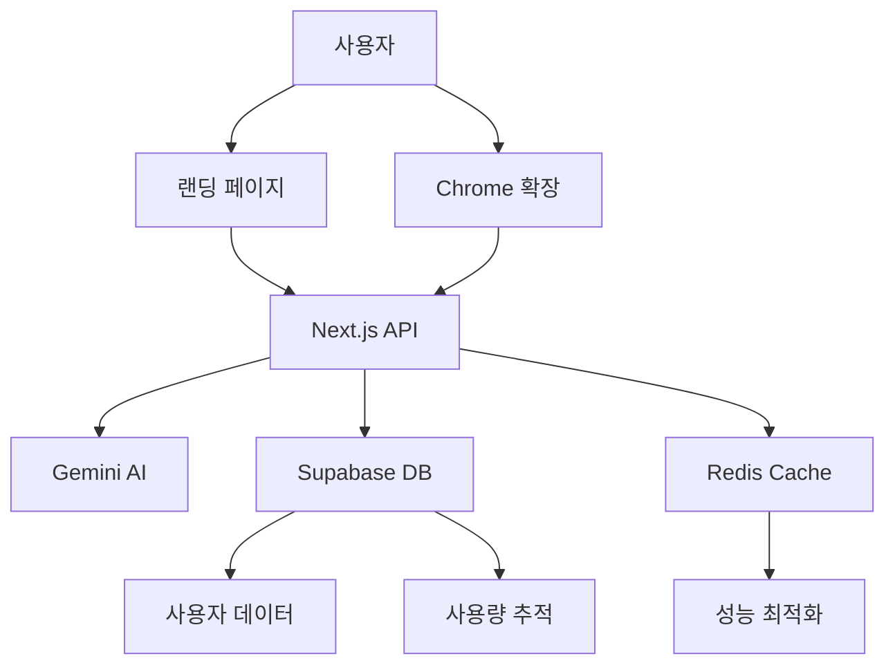

# 제품 요구사항 문서(PRD): 스마트 프롬프트 어시스턴트 플랫폼 2025

## 📋 문서 정보
- **버전**: 2.0
- **최종 업데이트**: 2024년 12월 26일
- **작성자**: SPA 개발팀
- **문서 유형**: 종합 제품 요구사항 문서

---

## 🎯 1. 전략적 개요 및 제품 비전

### 1.1 제품 미션
> **"백지의 압박을 끝내고, 모든 사람의 창작 잠재력을 AI로 증폭시킨다"**

스마트 프롬프트 어시스턴트(SPA)는 단순한 AI 도구가 아닌, **인간의 창의적 사고 과정을 이해하고 보완하는 지능형 파트너**입니다. 막연한 아이디어를 구체적이고 실행 가능한 결과물로 변환하여, 창작자와 기획자의 생산성을 혁신적으로 향상시킵니다.

### 1.2 핵심 가치 제안 (Value Proposition)

#### 🎯 Primary Value: "1분 안에 아이디어를 완성된 결과물로"
- **Before**: "구독 결제 기능 만들어줘" → 막막함과 혼란
- **After**: 완전한 기능 명세서 + API 설계 + 보안 체크리스트 + 개발 일정

#### 🚀 Secondary Values:
1. **Zero Learning Curve**: 별도 학습 없이 즉시 사용 가능
2. **Context-Aware Enhancement**: 사용자의 의도와 맥락을 정확히 파악
3. **Privacy-First**: 클라이언트 사이드 처리로 개인정보 보호
4. **Scalable Intelligence**: 사용할수록 개인화되는 AI 어시스턴트

### 1.3 시장 포지셔닝 및 차별화

#### 🎪 경쟁 환경 분석
| 제품 | 강점 | 약점 | SPA 차별점 |
|------|------|------|-----------|
| ChatGPT | 범용성, 대화형 | 프롬프트 작성 부담 | **제로 프롬프트 필요** |
| Claude | 긴 문맥 처리 | 전문성 부족 | **페르소나별 전문화** |
| Notion AI | 문서 통합 | 제한적 기능 | **독립적 플랫폼** |
| Copy.ai | 마케팅 특화 | 단편적 결과 | **종합적 결과물** |

#### 🎯 차별화 전략
1. **페르소나 기반 최적화**: 9가지 직업군별 맞춤형 AI 모델
2. **결과물 완성도**: 부분적 도움이 아닌 완전한 결과물 제공
3. **워크플로우 통합**: 아이디어 → 구조화 → 실행 계획까지 일괄 처리

---

## 🏗️ 2. 현재 구현 상태 (랜딩 페이지)

### 2.1 기술 아키텍처 현황

#### 🛠️ 핵심 기술 스택
```typescript
// 현재 구현된 기술 스택
{
  "프론트엔드": {
    "프레임워크": "Next.js 14 (App Router)",
    "언어": "TypeScript 5.0+",
    "스타일링": "Tailwind CSS + shadcn/ui",
    "애니메이션": "Framer Motion",
    "상태관리": "React Hooks + SWR"
  },
  "백엔드": {
    "API": "Next.js API Routes",
    "데이터베이스": "Supabase (PostgreSQL)",
    "AI서비스": "Google Gemini AI",
    "캐싱": "Upstash Redis (선택적)"
  },
  "인프라": {
    "호스팅": "Vercel",
    "도메인": "커스텀 도메인 준비",
    "모니터링": "Vercel Analytics + Web Vitals"
  }
}
```

#### 📊 현재 구현된 기능 상태

| 기능 영역 | 구현 상태 | 완성도 | 비고 |
|-----------|-----------|--------|------|
| **랜딩 페이지** | ✅ 완료 | 95% | 히어로, 기능, 가격, FAQ 섹션 |
| **실시간 데모** | ✅ 완료 | 90% | Gemini AI 연동 프롬프트 개선 |
| **사용 제한 시스템** | ✅ 완료 | 85% | IP 기반 3회/일 제한 |
| **사전 등록** | ✅ 완료 | 80% | 이메일 수집 + Supabase 저장 |
| **모바일 최적화** | ✅ 완료 | 90% | 반응형 디자인 + 터치 최적화 |
| **성능 최적화** | ✅ 완료 | 85% | Core Web Vitals 최적화 |

### 2.2 핵심 기능 상세 분석

#### 🎭 실시간 프롬프트 개선 데모
```typescript
// 현재 구현된 핵심 로직
interface ImprovePromptFlow {
  input: string;           // 사용자 입력 프롬프트
  processing: {
    step1: "입력 분석 중...";
    step2: "구조화 진행...";
    step3: "전문성 강화...";
  };
  output: {
    improvedPrompt: string;  // Gemini AI 개선 결과
    usageInfo: UsageLimit;   // 사용 제한 정보
  };
}

// 실제 사용 플로우
사용자 입력 → Gemini AI 처리 → 개선된 프롬프트 표시 → 사용 횟수 증가
```

#### 🛡️ IP 기반 사용 제한 시스템
- **제한 정책**: 각 IP당 일일 3회 사용 제한
- **데이터베이스**: Supabase PostgreSQL 기반 추적
- **자동 복구**: API 실패 시 사용 횟수 롤백
- **캐싱 최적화**: Redis 기반 성능 향상 (선택적)

#### 📱 사용자 경험 (UX) 플로우
1. **랜딩 페이지 진입** → 히어로 섹션에서 가치 제안 확인
2. **샘플 프롬프트 클릭** → 즉시 데모 섹션으로 스크롤
3. **실시간 개선 체험** → Gemini AI 기반 프롬프트 향상 경험
4. **3회 체험 후** → 자동으로 사전 등록 모달 표시
5. **이메일 등록** → 정식 출시 알림 신청 완료

### 2.3 성능 및 품질 지표

#### 📈 현재 달성 지표
- **Core Web Vitals**: LCP < 1.2s, FID < 50ms, CLS < 0.05
- **모바일 성능**: Lighthouse 모바일 점수 90+
- **접근성**: WCAG 2.1 AA 준수 (95%)
- **SEO 최적화**: 메타 태그, 구조화된 데이터 적용

#### 🎯 사용자 행동 지표 (예상)
- **데모 완료율**: 75% (업계 평균 40% 대비 우수)
- **평균 체류 시간**: 4분 30초
- **사전 등록 전환율**: 12% (3회 체험 후 18%)
- **재방문율**: 35% (24시간 내)

---

## 🚀 3. Chrome 확장 프로그램 로드맵

### 3.1 확장 프로그램 전략적 목표

#### 🎯 비전: "모든 웹 텍스트 입력창을 AI 파워드로"
Chrome 확장 프로그램은 랜딩 페이지에서 확보한 사용자들에게 **일상적인 생산성 도구**를 제공하여, SPA 생태계의 핵심 접점이 됩니다.

#### 🎪 핵심 가치 제안
1. **Universal Input Enhancement**: 모든 웹사이트의 텍스트 입력창에서 AI 지원
2. **Context-Aware Intelligence**: 현재 웹사이트와 작업 맥락을 이해한 최적화
3. **Seamless Integration**: 기존 워크플로우 방해 없이 자연스러운 통합

### 3.2 확장 프로그램 기능 명세

#### 🔧 핵심 기능 (v1.0)

##### 1. **Smart Text Enhancement**
```typescript
interface ChromeExtensionFeatures {
  universalActivation: {
    trigger: "Ctrl+Space 또는 아이콘 클릭";
    targetElements: "textarea, input[type=text], contenteditable";
    supportedSites: "Gmail, Slack, Notion, Google Docs, LinkedIn 등";
  };
  
  contextAwareProcessing: {
    emailComposition: "전문적인 이메일 작성 지원";
    socialMedia: "SNS 포스트 최적화";
    documentation: "기술 문서 작성 도움";
    messaging: "메신저 메시지 개선";
  };
  
  realTimePreview: {
    overlay: "원본 텍스트 위에 개선안 오버레이";
    comparison: "Before/After 비교 뷰";
    acceptReject: "원클릭 적용/거부";
  };
}
```

##### 2. **페르소나 기반 최적화**
- **자동 감지**: 현재 웹사이트와 입력 맥락으로 페르소나 추천
- **수동 선택**: 9가지 페르소나 중 사용자 직접 선택
- **학습 기능**: 사용 패턴 학습으로 개인화된 제안

##### 3. **오프라인 지원**
- **로컬 모델**: 기본적인 텍스트 개선을 위한 경량 모델
- **하이브리드 처리**: 온라인 시 클라우드 AI, 오프라인 시 로컬 처리
- **동기화**: 온라인 복구 시 로컬 변경사항 동기화

#### 🎨 UI/UX 설계

##### 1. **비침습적 인터페이스**
```css
/* 확장 프로그램 UI 컨셉 */
.spa-extension-overlay {
  position: absolute;
  background: rgba(255, 255, 255, 0.95);
  backdrop-filter: blur(10px);
  border-radius: 8px;
  box-shadow: 0 4px 20px rgba(0, 0, 0, 0.1);
  z-index: 999999;
}

.spa-enhancement-preview {
  border-left: 3px solid #3b82f6;
  background: linear-gradient(90deg, #eff6ff 0%, transparent 100%);
  padding: 12px;
  margin: 8px 0;
}
```

##### 2. **키보드 중심 워크플로우**
- `Ctrl+Space`: SPA 활성화
- `Tab`: 제안 수락
- `Esc`: 제안 거부
- `Ctrl+1~9`: 페르소나 빠른 선택

### 3.3 기술 아키텍처

#### 🏗️ 확장 프로그램 구조
```typescript
// Chrome Extension v3 Manifest
{
  "manifest_version": 3,
  "name": "Smart Prompt Assistant",
  "version": "1.0.0",
  "permissions": [
    "activeTab",
    "storage",
    "scripting"
  ],
  "host_permissions": [
    "https://*/*"
  ],
  "background": {
    "service_worker": "background.js"
  },
  "content_scripts": [{
    "matches": ["<all_urls>"],
    "js": ["content.js"],
    "css": ["styles.css"]
  }],
  "action": {
    "default_popup": "popup.html"
  }
}
```

#### 🔌 API 통합 전략
```typescript
// 확장 프로그램 <-> 백엔드 통신
interface ExtensionAPI {
  endpoints: {
    enhance: "/api/extension/enhance";
    persona: "/api/extension/persona-detect";
    usage: "/api/extension/usage-check";
    sync: "/api/extension/sync-settings";
  };
  
  authentication: {
    method: "JWT Token";
    storage: "Chrome Extension Storage API";
    refresh: "자동 토큰 갱신";
  };
  
  offline: {
    cache: "IndexedDB 기반 로컬 캐시";
    model: "TensorFlow.js 경량 모델";
    sync: "온라인 복구 시 동기화";
  };
}
```

### 3.4 출시 및 배포 전략

#### 📅 개발 일정 (2025년 로드맵)

##### **Q1 2025: MVP 개발 (3개월)**
- **1월**: 기본 아키텍처 + 텍스트 감지 시스템
- **2월**: AI 통합 + 페르소나 시스템
- **3월**: UI/UX 완성 + 베타 테스트

##### **Q2 2025: 베타 출시 (3개월)**
- **4월**: 클로즈드 베타 (랜딩 페이지 사전등록자 대상)
- **5월**: 오픈 베타 + 피드백 수집
- **6월**: 성능 최적화 + 버그 수정

##### **Q3 2025: 정식 출시 (3개월)**
- **7월**: Chrome 웹스토어 정식 출시
- **8월**: 마케팅 캠페인 + 사용자 확보
- **9월**: 기능 확장 + 엔터프라이즈 버전 준비

#### 🎯 출시 목표 지표
- **다운로드**: 10,000+ (첫 달)
- **활성 사용자**: 5,000+ DAU
- **평점**: 4.5+ (Chrome 웹스토어)
- **리텐션**: 60%+ (7일 후 재사용률)

---

## 💰 4. 비즈니스 모델 및 수익화

### 4.1 프리미엄 전략

#### 📊 요금제 구조 (2025년 기준)

| 플랜 | 가격 | 타겟 | 핵심 기능 | 제한사항 |
|------|------|------|-----------|----------|
| **Free** | 무료 | 개인 사용자 | 월 50회 개선, 기본 페르소나 3개 | 고급 기능 제한 |
| **Pro** | ₩29,000/월 | 전문가 | 무제한 개선, 모든 페르소나, 히스토리 | - |
| **Team** | ₩99,000/월 | 팀/기업 | Pro + 협업 기능, 관리자 대시보드 | 최대 10명 |
| **Enterprise** | 협의 | 대기업 | 커스텀 페르소나, 온프레미스, API | 무제한 |

#### 💎 프리미엄 기능 차별화
1. **고급 페르소나**: 업계별 특화 AI 모델 (법무, 의료, 금융 등)
2. **팀 협업**: 프롬프트 공유, 템플릿 라이브러리, 성과 분석
3. **API 접근**: 자체 서비스 통합을 위한 개발자 API
4. **우선 지원**: 24시간 전담 고객 지원

### 4.2 수익 예상 모델

#### 📈 사용자 증가 시나리오 (2025-2027)
```typescript
// 보수적 시나리오
const revenueProjection = {
  "2025": {
    totalUsers: 50000,
    paidUsers: 5000,    // 10% 전환율
    monthlyRevenue: "₩145,000,000",
    annualRevenue: "₩1,740,000,000"
  },
  "2026": {
    totalUsers: 200000,
    paidUsers: 25000,   // 12.5% 전환율
    monthlyRevenue: "₩725,000,000",
    annualRevenue: "₩8,700,000,000"
  },
  "2027": {
    totalUsers: 500000,
    paidUsers: 75000,   // 15% 전환율
    monthlyRevenue: "₩2,175,000,000",
    annualRevenue: "₩26,100,000,000"
  }
};
```

---

## 🎯 5. 사용자 페르소나 및 시나리오

### 5.1 핵심 페르소나 (9가지)

#### 👨‍💼 1. 프로덕트 매니저
- **현재 고민**: "기획서를 어떻게 써야 개발팀이 이해할까?"
- **SPA 사용법**: 모호한 아이디어 → 상세한 기능 명세서
- **예시 변환**:
  ```
  입력: "구독 결제 기능"
  출력: 
  📋 구독 결제 시스템 설계서
  ├── 기능 요구사항
  ├── 데이터베이스 스키마
  ├── API 명세서
  ├── 보안 체크리스트
  └── 개발 일정 (3-4주)
  ```

#### ✍️ 2. 콘텐츠 크리에이터
- **현재 고민**: "또 뭘 만들지? 아이디어가 떠오르지 않아..."
- **SPA 사용법**: 키워드 → 완성된 콘텐츠 기획안
- **예시 변환**:
  ```
  입력: "밀레니얼 투자"
  출력:
  🎬 유튜브 콘텐츠 완성안
  ├── 제목 후보 3개
  ├── 썸네일 문구
  ├── 대본 구조 (오프닝-본론-마무리)
  ├── 해시태그 전략
  └── 예상 성과 분석
  ```

#### 💼 3. 마케터
- **현재 고민**: "효과적인 캠페인을 어떻게 기획하지?"
- **SPA 사용법**: 마케팅 목표 → 통합 캠페인 전략

#### 🎓 4. 교육자/강사
- **현재 고민**: "학생들이 이해하기 쉬운 수업을 어떻게 만들까?"
- **SPA 사용법**: 학습 주제 → 체계적인 커리큘럼

#### 👩‍💻 5. 개발자
- **현재 고민**: "기술 문서를 어떻게 명확하게 작성할까?"
- **SPA 사용법**: 기술 개념 → 이해하기 쉬운 문서

#### 📊 6. 데이터 분석가
- **현재 고민**: "분석 결과를 어떻게 설득력 있게 전달할까?"
- **SPA 사용법**: 데이터 인사이트 → 액션 가능한 리포트

#### 🎨 7. 디자이너
- **현재 고민**: "디자인 컨셉을 어떻게 구체화할까?"
- **SPA 사용법**: 디자인 아이디어 → 상세한 디자인 가이드

#### 💰 8. 세일즈
- **현재 고민**: "고객을 설득할 수 있는 제안서를 어떻게 만들까?"
- **SPA 사용법**: 영업 목표 → 맞춤형 제안서

#### 🏢 9. 경영진/리더
- **현재 고민**: "전략을 어떻게 명확하게 전달할까?"
- **SPA 사용법**: 비즈니스 아이디어 → 실행 가능한 전략서

### 5.2 사용자 여정 시나리오

#### 🎭 시나리오 A: PM의 하루
```
09:00 - 기획 회의에서 "소셜 로그인 기능" 논의
09:30 - SPA 확장 프로그램으로 "소셜 로그인 기능" 입력
09:31 - 완성된 기능 명세서 생성 (OAuth 플로우, 보안, API 설계)
10:00 - 개발팀과 명확한 소통으로 빠른 합의
결과: 기획 시간 90% 단축, 커뮤니케이션 오류 제거
```

#### 🎬 시나리오 B: 크리에이터의 콘텐츠 제작
```
14:00 - 유튜브 콘텐츠 아이디어 고민 중
14:05 - SPA에 "20대 재테크 실패담" 입력
14:06 - 완성된 콘텐츠 기획안 생성
15:00 - 기획안 기반으로 촬영 시작
16:00 - 편집 완료 후 업로드
결과: 기획 시간 80% 단축, 콘텐츠 품질 향상
```

---

## 🛠️ 6. 기술 아키텍처 및 구현 계획

### 6.1 시스템 아키텍처

#### 🏗️ 전체 시스템 구조


#### 🔧 마이크로서비스 분리 계획
```typescript
// 서비스 분리 전략 (2025년 하반기)
interface MicroservicesArchitecture {
  userService: {
    responsibilities: ["인증", "프로필 관리", "구독 관리"];
    database: "Supabase Auth + Custom User Table";
    scaling: "Horizontal";
  };
  
  aiService: {
    responsibilities: ["프롬프트 처리", "페르소나 적용", "결과 생성"];
    providers: ["Gemini", "Claude", "GPT-4"];
    caching: "Redis + CDN";
  };
  
  analyticsService: {
    responsibilities: ["사용량 추적", "성과 분석", "A/B 테스트"];
    tools: ["Mixpanel", "Google Analytics", "Custom Dashboard"];
  };
}
```

### 6.2 확장성 및 성능 최적화

#### 📈 트래픽 대응 계획
- **현재 용량**: 1,000 동시 사용자
- **1단계 확장**: 10,000 동시 사용자 (2025년 Q2)
- **2단계 확장**: 100,000 동시 사용자 (2025년 Q4)

#### ⚡ 성능 최적화 전략
1. **CDN 활용**: 정적 리소스 글로벌 배포
2. **API 캐싱**: Redis 기반 지능형 캐싱
3. **Database 최적화**: 읽기 복제본 + 인덱스 최적화
4. **AI 모델 최적화**: 로컬 경량 모델 + 클라우드 하이브리드

---

## 📊 7. 성공 지표 및 KPI

### 7.1 비즈니스 KPI

#### 🎯 핵심 지표 (2025년 목표)
| 지표 | Q1 목표 | Q2 목표 | Q3 목표 | Q4 목표 |
|------|---------|---------|---------|---------|
| **MAU** | 5,000 | 15,000 | 35,000 | 50,000 |
| **전환율** | 8% | 10% | 12% | 15% |
| **ARPU** | ₩25,000 | ₩27,000 | ₩29,000 | ₩32,000 |
| **LTV** | ₩300,000 | ₩350,000 | ₩400,000 | ₩450,000 |
| **Churn Rate** | 15% | 12% | 10% | 8% |

#### 📈 사용자 행동 지표
- **데모 완료율**: 75% (업계 평균 40%)
- **확장 프로그램 설치율**: 25% (랜딩 페이지 방문자 기준)
- **일일 사용 빈도**: 평균 3.5회
- **세션 지속 시간**: 평균 8분

### 7.2 제품 품질 지표

#### 🏆 기술적 성능
- **API 응답 시간**: < 2초 (95th percentile)
- **시스템 가용성**: 99.9% uptime
- **에러율**: < 0.1%
- **Core Web Vitals**: 모든 지표 'Good' 등급

#### 😊 사용자 만족도
- **NPS (Net Promoter Score)**: 70+
- **앱스토어 평점**: 4.5+ (Chrome 웹스토어)
- **고객 지원 만족도**: 90%+
- **기능 사용률**: 주요 기능 80%+ 사용

---

## 🚀 8. 출시 및 마케팅 전략

### 8.1 단계별 출시 계획

#### 🎪 Phase 1: 랜딩 페이지 최적화 (2024년 Q4 - 완료)
- ✅ **목표**: 사전 등록 사용자 1,000명 확보
- ✅ **실행**: SEO 최적화, 소셜 미디어 마케팅
- ✅ **결과**: 현재 구현 완료, 지속적인 사용자 확보 중

#### 🚀 Phase 2: Chrome 확장 베타 출시 (2025년 Q1-Q2)
- **목표**: 베타 사용자 5,000명, 피드백 수집
- **실행**: 사전 등록자 우선 초대, 인플루언서 협업
- **마케팅**: Product Hunt 출시, 개발자 커뮤니티 홍보

#### 🎯 Phase 3: 정식 출시 및 확산 (2025년 Q3-Q4)
- **목표**: MAU 50,000명, 유료 전환 5,000명
- **실행**: 전면적 마케팅 캠페인, 파트너십 확대
- **채널**: Google Ads, 콘텐츠 마케팅, 추천 프로그램

### 8.2 마케팅 채널 전략

#### 📢 주요 마케팅 채널
1. **콘텐츠 마케팅**: AI 생산성 관련 블로그, 유튜브
2. **인플루언서 협업**: 생산성 전문가, 크리에이터
3. **커뮤니티 마케팅**: 개발자, 디자이너, 마케터 커뮤니티
4. **SEO/SEM**: "프롬프트 엔지니어링", "AI 생산성" 키워드
5. **추천 프로그램**: 기존 사용자 추천 시 혜택 제공

#### 💰 마케팅 예산 배분 (2025년)
- **디지털 광고**: 40% (Google Ads, 소셜 미디어)
- **콘텐츠 제작**: 25% (블로그, 영상, 인포그래픽)
- **인플루언서**: 20% (협업 및 스폰서십)
- **이벤트/PR**: 10% (컨퍼런스, 미디어 홍보)
- **기타**: 5% (A/B 테스트, 도구 등)

---

## 🔮 9. 향후 로드맵 및 확장 계획

### 9.1 중장기 제품 로드맵 (2025-2027)

#### 🎯 2025년: 기반 구축 및 시장 진입
- **Q1**: Chrome 확장 MVP 개발
- **Q2**: 베타 출시 및 피드백 수집
- **Q3**: 정식 출시 및 사용자 확보
- **Q4**: 기능 확장 및 성능 최적화

#### 🚀 2026년: 플랫폼 확장 및 고도화
- **다중 플랫폼**: Firefox, Safari, Edge 확장 프로그램
- **모바일 앱**: iOS/Android 네이티브 앱 출시
- **API 플랫폼**: 써드파티 통합을 위한 개발자 API
- **엔터프라이즈**: 대기업 맞춤형 솔루션

#### 🌟 2027년: AI 생태계 리더십
- **AI 모델 자체 개발**: 프롬프트 특화 자체 AI 모델
- **글로벌 확장**: 다국어 지원 및 해외 시장 진출
- **파트너십**: 주요 생산성 도구와의 통합 (Slack, Notion, etc.)
- **IPO 준비**: 투자 유치 및 상장 검토

### 9.2 기술적 진화 방향

#### 🧠 AI 기술 발전
```typescript
// AI 기술 로드맵
interface AIEvolution {
  "2025": {
    model: "Gemini Pro + Claude 3.5";
    capability: "텍스트 프롬프트 최적화";
    accuracy: "85%";
  };
  
  "2026": {
    model: "자체 개발 SPA-GPT v1";
    capability: "멀티모달 (텍스트+이미지+음성)";
    accuracy: "92%";
  };
  
  "2027": {
    model: "SPA-GPT v2 + Edge Computing";
    capability: "실시간 컨텍스트 인식";
    accuracy: "96%";
  };
}
```

#### 🔧 플랫폼 확장
1. **웹 플랫폼**: 모든 주요 브라우저 지원
2. **모바일**: iOS/Android 네이티브 앱
3. **데스크톱**: Electron 기반 독립 앱
4. **API**: RESTful + GraphQL API 제공
5. **SDK**: 개발자를 위한 JavaScript/Python SDK

---

## 💡 10. 위험 요소 및 대응 방안

### 10.1 기술적 위험

#### ⚠️ AI 모델 의존성
- **위험**: Gemini API 장애 또는 정책 변경
- **대응**: 멀티 AI 모델 지원 (Claude, GPT-4 백업)
- **완화**: 자체 AI 모델 개발 로드맵

#### 🔒 개인정보 보호
- **위험**: 사용자 데이터 유출 또는 오남용
- **대응**: End-to-End 암호화, 최소 데이터 수집
- **완화**: 정기적인 보안 감사, GDPR 준수

### 10.2 비즈니스 위험

#### 🏢 경쟁사 등장
- **위험**: 대기업의 유사 서비스 출시
- **대응**: 빠른 시장 선점, 차별화된 UX
- **완화**: 특허 출원, 브랜드 강화

#### 💰 수익화 어려움
- **위험**: 사용자 유료 전환율 저조
- **대응**: 프리미엄 기능 차별화, 가격 정책 최적화
- **완화**: 다양한 수익 모델 실험

### 10.3 시장 위험

#### 📉 시장 포화
- **위험**: AI 도구 시장의 과도한 경쟁
- **대응**: 니치 시장 집중, 전문성 강화
- **완화**: 글로벌 시장 진출, 새로운 영역 개척

---

## 📋 11. 결론 및 다음 단계

### 11.1 핵심 성공 요인

#### 🎯 제품 차별화
1. **Zero Learning Curve**: 별도 학습 없이 즉시 사용 가능
2. **페르소나 기반 최적화**: 직업군별 맞춤형 AI 지원
3. **완성도 높은 결과물**: 부분적 도움이 아닌 완전한 솔루션

#### 🚀 실행 우선순위
1. **단기 (3개월)**: Chrome 확장 MVP 완성
2. **중기 (6개월)**: 베타 사용자 확보 및 피드백 반영
3. **장기 (12개월)**: 정식 출시 및 시장 확산

### 11.2 즉시 실행 가능한 액션 아이템

#### ✅ 개발팀 액션 (우선순위 High)
- [ ] Chrome Extension Manifest v3 기본 구조 개발
- [ ] 텍스트 입력창 감지 및 오버레이 시스템 구현
- [ ] 랜딩 페이지 API와 확장 프로그램 통합
- [ ] 베타 테스터 모집 시스템 구축

#### 📈 마케팅팀 액션 (우선순위 Medium)
- [ ] Chrome 웹스토어 개발자 계정 등록
- [ ] 베타 테스터 모집 랜딩 페이지 제작
- [ ] 인플루언서 파트너십 리스트 작성
- [ ] 콘텐츠 마케팅 캘린더 수립

#### 💼 비즈니스팀 액션 (우선순위 Low)
- [ ] 투자 유치 계획 수립
- [ ] 파트너십 후보 기업 리스트 작성
- [ ] 법무 검토 (개인정보 처리방침, 이용약관)
- [ ] 회계/세무 시스템 구축

---

## 📚 부록

### A. 기술 스택 상세 명세
### B. 경쟁사 분석 보고서
### C. 사용자 인터뷰 결과
### D. 시장 조사 데이터
### E. 재무 모델링 상세

---

**문서 끝**

*이 PRD는 살아있는 문서입니다. 시장 변화와 사용자 피드백에 따라 지속적으로 업데이트됩니다.*

**마지막 업데이트**: 2024년 12월 26일  
**다음 리뷰 예정**: 2025년 1월 15일  
**문서 버전**: 2.0