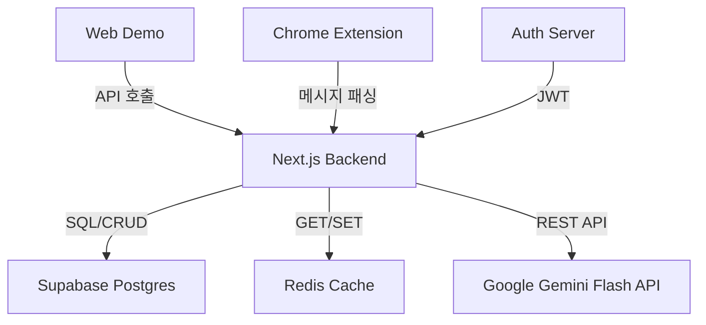

# Technical Requirements Document (TRD)

## 1. Executive Technical Summary
- **프로젝트 개요**  
  Smart Prompt Assistant는 크롬 확장 및 웹 데모 형태로 제공되며, 사용자의 자연어 입력을 Google Gemini Flash API를 통해 전문가급 프롬프트로 즉시 변환합니다. Next.js 14 App Router와 Server Actions 기반 서버 렌더링+API 핸들러를 활용하여 빠른 응답성과 SEO 친화성을 확보합니다.
- **핵심 기술 스택**  
  Next.js 14, React, TypeScript, Supabase(Postgres/Auth), Redis, Google Gemini Flash, Vercel, Cloudflare CDN, Chrome Extension Manifest V3
- **주요 기술 목표**  
  • 95퍼센타일 응답 3초 이하 유지  
  • 일일 10k 동시 요청 처리 가능  
  • 크롬 익스텐션 설치→사용 전환율 60% 이상  
- **핵심 가정사항**  
  • Google Gemini Flash API 안정성 보장  
  • Supabase 및 Redis로 확장성 있는 세션·캐시 관리 가능  
  • Vercel/Cloudflare를 통한 글로벌 CDN 배포 성능 충족  

## 2. Tech Stack

| Category        | Technology / Library        | Reasoning (선택 이유)                                                |
| --------------- | --------------------------- | -------------------------------------------------------------------- |
| Frontend        | Next.js 14 (App Router)     | SSR/SSG 지원, Server Actions로 API 통합, SEO·퍼포먼스 우수           |
| 언어·타입       | TypeScript                  | 정적 타입 검사, 유지보수성·안정성 향상                              |
| 스타일링        | Tailwind CSS                | 유틸리티 퍼스트, 빠른 UI 개발, 커스텀 좌우 유연성                   |
| 백엔드 (API)    | Next.js Server Actions      | 프론트엔드와 동일 코드베이스, 별도 서버 불필요                        |
| 데이터베이스    | Supabase Postgres           | 완전 관리형 Postgres, 실시간 기능 및 Auth 통합 용이                |
| 캐싱·RateLimit  | Redis                       | 고속 인메모리 캐시·레이트 리미트 집계, 사용량 제한 구현             |
| 인증·인가       | Supabase Auth + OAuth2      | 내장 소셜 로그인(OAuth), JWT 기반 인증 관리 간편                    |
| AI 연동         | Google Gemini Flash API     | 프롬프트 개선 전문화 모델, 낮은 레이턴시                             |
| 배포·CDN        | Vercel + Cloudflare CDN     | 자동화 CI/CD, 글로벌 엣지 캐싱                                      |
| 크롬 확장        | Chrome Extension Manifest V3| 최신 브라우저 호환, 안전한 권한 모델                                 |

## 3. System Architecture Design

### Top-Level Building Blocks
- **웹 데모 애플리케이션**  
  - Next.js 14 App Router, Server Actions  
  - UI 컴포넌트(Tailwind CSS)  
  - 샘플 프롬프트 카드, 타이핑 애니메이션
- **크롬 익스텐션**  
  - Manifest V3 기반 사이드패널 버튼  
  - 메시지 패싱(Messaging API)으로 백엔드 호출
- **API 레이어**  
  - Next.js Server Actions로 프롬프트 개선/생성 API  
  - OAuth 인증, 요청 제한 로직, Redis 캐싱
- **데이터 저장소**  
  - Supabase Postgres: 사용자·히스토리, 사용량 카운트  
  - Redis: 일일 호출 카운트, 임시 캐시
- **AI 서비스 통합**  
  - Google Gemini Flash REST API 호출 및 응답 파싱
- **인증·보안**  
  - Supabase Auth(OAuth2), HTTPS, 데이터 암호화 at rest

### Top-Level Component Interaction Diagram

- 웹 데모와 크롬 확장은 공통 Next.js 백엔드 API를 호출  
- 백엔드는 Redis에 요청 제한 및 캐싱 정보를 저장/조회  
- Postgres는 사용자 프로필·히스토리·사용량 기록 저장  
- AI 모델 호출을 통해 프롬프트 개선·생성 결과 반환  
- Supabase Auth로 OAuth2 로그인 및 JWT 토큰 발급/검증  

### Code Organization & Convention
**Domain-Driven Organization Strategy**  
- Domain Separation: user, prompt, usage, auth, extension  
- Layer-Based Architecture: presentation(UI), business(services), data(access), infra(API 클라이언트)  
- Feature-Based Modules: src/features/{domain} 구조  
- Shared Components: src/components/ui, src/lib/utils, src/types

**Universal File & Folder Structure**
```
/
├── apps
│   ├── web                  # Next.js 웹 데모
│   │   ├── app              # App Router
│   │   ├── components       # UI 컴포넌트
│   │   ├── features         # 도메인별 기능 모듈
│   │   └── styles
│   └── extension            # 크롬 익스텐션 소스
│       ├── src
│       ├── manifest.json
│       └── background.js
├── libs
│   ├── api                  # Gemini API 클라이언트
│   ├── auth                 # Supabase Auth 설정
│   └── db                   # Supabase/Redis 초기화
├── prisma                   # 스키마 및 마이그레이션
├── public                   # 정적 자산
├── scripts                  # 배포/빌드 스크립트
└── tsconfig.json
```

### Data Flow & Communication Patterns
- **Client-Server Communication**: HTTPS REST/Server Actions, JWT Bearer 토큰  
- **Database Interaction**: Prisma ORM → Supabase Postgres, connection pooling  
- **External Service Integration**: Google Gemini Flash REST 호출, 재시도 로직  
- **실시간 통신**: 필요 시 Server-Sent Events(히스토리 피드) 확장 가능  
- **Data Synchronization**: 캐시 만료 정책(24h) 및 Redis pub/sub 활용

## 4. Performance & Optimization Strategy
- Next.js ISR/SSR 조합으로 초기 로드 속도 최적화  
- Redis 캐싱으로 반복 요청·레이트 리미트 처리  
- 코드 스플리팅 및 이미지 최적화(Tailwind JIT, Vercel Edge)  
- API 호출 병렬화 및 응답 로깅·모니터링  

## 5. Implementation Roadmap & Milestones

### Phase 1: Foundation (MVP Implementation)
- **Core Infrastructure**: Next.js 프로젝트 초기화, Supabase/Redis 연결  
- **Essential Features**: 프롬프트 개선 API, Before/After UI, 일일 사용량 제한  
- **Basic Security**: OAuth2 로그인, HTTPS 적용  
- **Development Setup**: Git, Vercel CI/CD 파이프라인  
- **Timeline**: M0~M1

### Phase 2: Feature Enhancement
- **Advanced Features**: 페르소나 템플릿, 샘플 카드, 키보드 단축키  
- **Performance Optimization**: CDN 캐싱 정책, SSR 최적화  
- **Enhanced Security**: CAPTCHA, CSP 헤더 강화  
- **Monitoring Implementation**: Sentry, Vercel Analytics  
- **Timeline**: M2

### Phase 3: Scaling & Optimization
- **Scalability Implementation**: Auto-scaling Redis 인스턴스, DB Read Replica  
- **Advanced Integrations**: 다국어 번역 모드, 히스토리 보관함  
- **Enterprise Features**: 팀 요금제 대시보드  
- **Compliance & Auditing**: GDPR/ISO 보안 표준 대응  
- **Timeline**: M3~M4

## 6. Risk Assessment & Mitigation Strategies

### Technical Risk Analysis
- **Technology Risks**: Gemini API 호출 실패 → 재시도/폴백 모델(Claude) 연동  
- **Performance Risks**: 동시 10k 요청 과부하 → Redis 캐시·Rate Limit 강화  
- **Security Risks**: OAuth 토큰 탈취 → HTTPS·JWT 만료 정책 엄격화  
- **Integration Risks**: Supabase 서비스 장애 → 다중 리전 DB 백업  
- **Mitigation Strategies**: 장애 대비 이중화, 재시도 로직, SLA 모니터링  

### Project Delivery Risks
- **Timeline Risks**: 의존성 병목 → 스파이크(개발 예비 시간) 확보  
- **Resource Risks**: 기술 숙련도 편차 → 초기 온보딩 세션, 코드 리뷰  
- **Quality Risks**: 테스트 커버리지 부족 → 유닛·통합 테스트 필수화  
- **Deployment Risks**: 환경별 설정 오류 → IaC 스크립트, 별도 스테이징  
- **Contingency Plans**: 주요 기능 롤백 전략, 대체 API 플랜 확보  

---